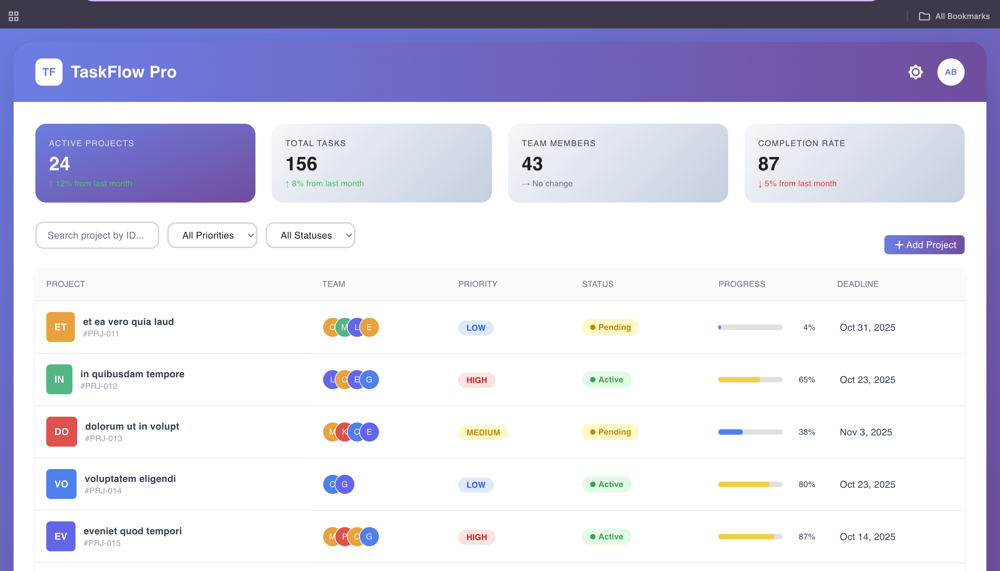

# Rival-IO Assessment

## 📌 Overview
A project management dashboard where users can add, view, and track projects with details like title, description, deadline, priority, and team members.  

Live Demo: [Click Here](https://rival-io-assesment-aryanbhandari-88odi7fjw.vercel.app/)

---

## 🚀 How to Run the Project Locally

1. **Clone the repository**
   ```bash
   git clone https://github.com/aryanbha123/rival.io-assesment-aryanbhandari.git
   cd rival.io-assesment-aryanbhandari
2. **Install dependencies**
    ```bash
    npm install
3.  **Start the development server**
    ```bash
    npm start
    Open your browser and go to:
    http://localhost:3000
    ```

# Assumptions Made
- Node.js  and npm are installed on the system.
- The app is primarily tested on modern browsers (Chrome, Firefox, Edge).
- Internet connection required for API calls.

# Features Implemented 
  - Add new project with title, description, deadline, priority, and team members
  - Project listing in a responsive table
  - Progress tracking with linear progress bar
  - Search and filter projects
  - Modal dialog for adding new projects
  - Deployed on Vercel for easy acces


### Dashboard View

